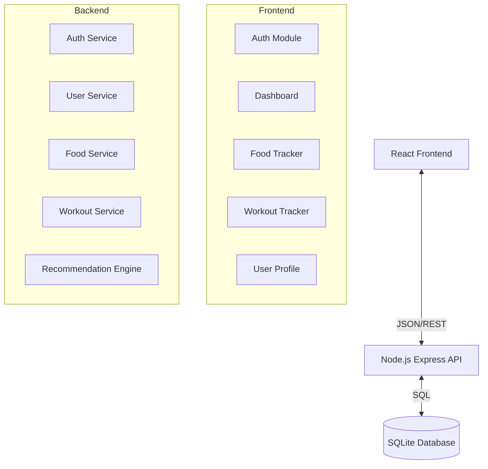

# Gym Freak Nutrition & Workout Website - System Architecture

## 1. System Overview
The application is a full-stack web platform designed to help users track their nutrition and workouts. It consists of a React-based Single Page Application (SPA) frontend and a Node.js/Express REST API backend backed by a SQLite database.

## 2. Architecture Diagram

## 3. Database Schema

### Users Table
| Column | Type | Description |
|--------|------|-------------|
| id | INTEGER PK | Unique ID |
| email | TEXT | User email (Unique) |
| password | TEXT | Hashed password |
| name | TEXT | Full name |
| age | INTEGER | Age in years |
| gender | TEXT | 'male' or 'female' |
| height | REAL | Height in cm |
| weight | REAL | Weight in kg |
| activity_level | TEXT | 'sedentary', 'moderate', 'active' |
| goal | TEXT | 'loss', 'gain', 'maintain' |
| created_at | DATETIME | Account creation date |

### Foods Table (Reference Data)
| Column | Type | Description |
|--------|------|-------------|
| id | INTEGER PK | Unique ID |
| name | TEXT | Food name |
| calories | REAL | Calories per serving |
| protein | REAL | Protein (g) |
| carbs | REAL | Carbs (g) |
| fat | REAL | Fat (g) |
| serving_size | REAL | Standard serving amount |
| unit | TEXT | 'g', 'ml', 'piece' |

### FoodEntries Table (Daily Logs)
| Column | Type | Description |
|--------|------|-------------|
| id | INTEGER PK | Unique ID |
| user_id | INTEGER FK | Reference to Users |
| food_id | INTEGER FK | Reference to Foods |
| date | TEXT | YYYY-MM-DD |
| quantity | REAL | Amount consumed |
| meal_type | TEXT | 'breakfast', 'lunch', 'dinner', 'snack' |

### Workouts Table
| Column | Type | Description |
|--------|------|-------------|
| id | INTEGER PK | Unique ID |
| user_id | INTEGER FK | Reference to Users |
| date | TEXT | YYYY-MM-DD |
| type | TEXT | 'cardio', 'strength' |
| exercise_name | TEXT | Name of exercise |
| duration | INTEGER | Minutes (for cardio) |
| sets | INTEGER | Number of sets |
| reps | INTEGER | Number of reps |
| weight | REAL | Weight used (kg) |
| calories_burned | REAL | Estimated burn |

## 4. API Endpoints

### Auth
- `POST /api/auth/register` - Register new user
- `POST /api/auth/login` - Login and get JWT

### User
- `GET /api/user/profile` - Get current user profile & metrics
- `PUT /api/user/profile` - Update profile

### Food
- `GET /api/foods/search?q=...` - Search food database
- `GET /api/foods/log/:date` - Get food log for a date
- `POST /api/foods/log` - Add food entry
- `DELETE /api/foods/log/:id` - Remove food entry

### Workout
- `GET /api/workouts/log/:date` - Get workouts for a date
- `POST /api/workouts/log` - Add workout
- `DELETE /api/workouts/log/:id` - Remove workout

### Dashboard
- `GET /api/dashboard/summary` - Get aggregated stats for today

## 5. Calculation Logic

### BMR (Mifflin-St Jeor)
- Men: `(10 × weight) + (6.25 × height) - (5 × age) + 5`
- Women: `(10 × weight) + (6.25 × height) - (5 × age) - 161`

### TDEE (Total Daily Energy Expenditure)
- Sedentary: `BMR × 1.2`
- Moderate: `BMR × 1.55`
- Active: `BMR × 1.725`

### Goal Adjustment
- Fat Loss: `TDEE - 500`
- Muscle Gain: `TDEE + 300`
- Maintenance: `TDEE`

### Macros
- Protein: ~2g per kg of bodyweight (adjustable based on goal)
- Fats: ~0.8g per kg
- Carbs: Remainder of calories
